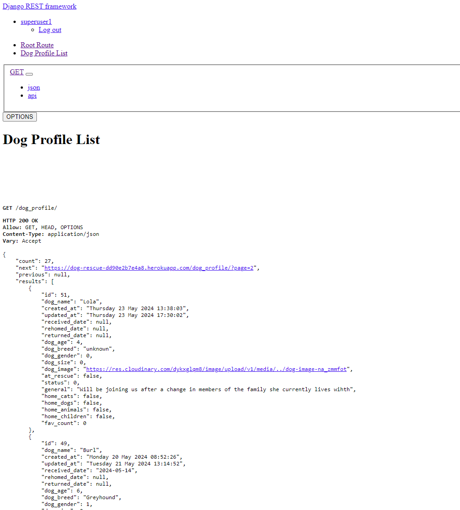
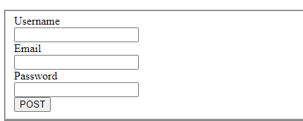
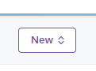
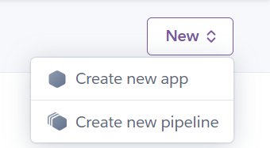
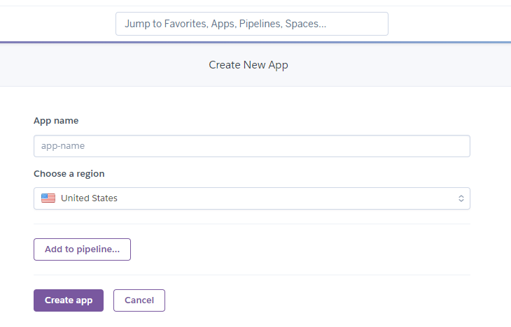
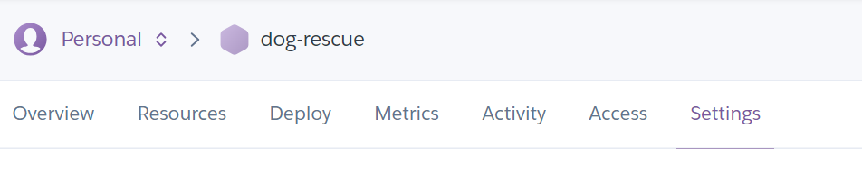
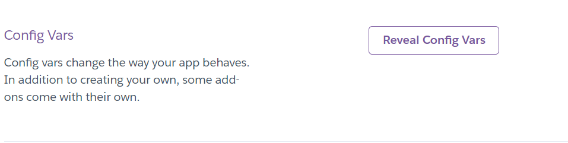
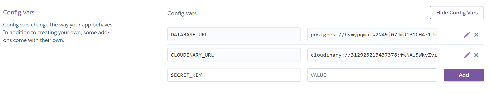
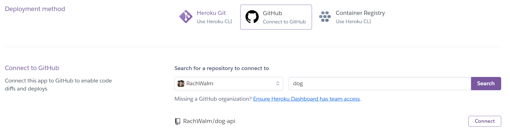
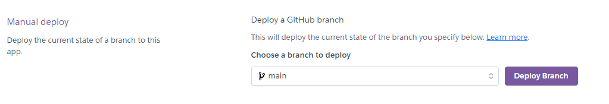

# Dog API

## Introduction

Welcome to [Dog API](https://dog-rescue-dd90e2b7e4a8.herokuapp.com/).



It can be accessed through [Dog API](https://dog-rescue-dd90e2b7e4a8.herokuapp.com/).

The Dog API is designed to allow data to be created/read/updated and deleted regarding a dog rescue/adoption service. It is essential that once the dogs have gone into a rescue their information is accurately and sustainably retained and accessible, and the API allows this information to be created, accessed and manipulated as an interface between a front end website and a database retaining the information.

As these rescues are often run by charities and volunteers, using IT solutions to gain exposure to the public and retain information on the dogs is often under-utilised. The people using it often have a low level of technical knowledge. This means that they would definitely not be able to access the data straight from the data base and need a connection to a user-friendly website that is intuitive to use. The API must make it easy for the users to perform their activities by making it easy to manipulate the data. Also advertising the opportunity to adopt the dogs needs to be user friendly and encourage people to look into adopting them, not difficult to access information, so this need to bridge the gap between the use of the site and it's use of the data base is critical.

The intent of the overall project is two-fold, 
1. to get the animals known to potential adopters (advertising their personalities on a feed/profile)
2. retain information on the dogs for use in the rescue regarding their history and needs. 

This means that it is essential that the information in the database is can be accessed and manipulated to achieve these goals, by all relevant parties with ease.

Most websites that are for rescues just have a photo, a couple of details and a paragraph of information to give a potential adopter information on the dogs. To step up the advertising campaign to get dogs adopted, rather than being limited to these features, this site endeavours to show their personalities by getting the public involved in their timelines with posts/comments from walkers and the public. This means that as well as a profile for the dog, there is a requirement to store posts, comments etc from users as well as data regarding queries from potential adopters.

The system will mean that the relevant information that the rescue requires day to day about the dog can be held in a profile(and add-ons), of which some parts are made public and the dog will also get a timeline, where walkers/volunteers/people involved with the dog can post pictures and stories to make the dog more appealing. This is particularly important for dogs that remain at the rescue for a significant amount of time as it raises their visibility and gets their personality/quirks known so suitable adopters can be found.

## UX design

The user of the API is intended to be a web based site that provides all required information in a way that can be easily used to produce an efficient website. The website can then be used by rescue admin, walkers, supporters and adopters. The API will have four levels of access:

1. Anonymous not logged in user
2. Authenticated User
3. Staff User
4. Superuser

Staff and superuser permissions will set in the admin panel and have greater access. Access increase as the number increases.

The data will be privately owned by the dog rescue and as such will need to be restricted to those with appropriate approvals, some read-only data will be available to the public, but to perform activities on the data will require relevant registration/login/authorisation(minimum user level for making changes - Authenticated User).

All of this data needs to be manipulated by the API in a way that is logical and can be interpreted to produce the features on a website with ease by the website developer.

### Relationship diagram

#### Initial idea diagram

The initial relationship diagram that was presented to my mentor:


There were several things that needed to be altered with the idea. So the diagram got more complicated but the priority got simplified.


1. It was decided to drop the custom_user and use a user and user_profile. This would make it similar to recent experience fo the developer and more efficient. The avatar was unnecessary as the site is about the dogs not the people (this could always be added to the user_profile as a future improvement). The type of account - which was going to be admin, staff, adopted owner or user will only be necessary if the adopted owner functionality was going to be implemented. The admin site can be used to manually set superusers, staff etc options. So this custom user functionality was not required at this stage.

2. It was noticed that there was a queries about adoption page in the wireframes for the front end but no where to store the information that would be put into that form to make a query about the dogs - which was essential functionality. So this was added to the relationship diagram

3. As allowing the adopted owners to post in the success stories section was decided to be a low priority feature adopter_profile was decided to be removed from the dog_profile table as it only might be relevant if that feature were implemented in the future.

Therefore, the priorities were going to be that it was essential to do user_profile, dog_profile, posts, comments and request_form (user would be set up as part of registration functionality and not by part of this development).

Time dependent would be then favourite and then emoji. With looking at allowing an adopter to post on their dogs timeline as a final functionality that would probably have to be a future development. During development, it was decided to split out the vaccination data from the dog profile so these became separate during development.

Most of the posts app and comments app will be very similar to the walkthrough provided by Code Institute as part of this course of study [git hub for walkthrough](https://github.com/Code-Institute-Solutions/drf-api/tree/ed54af9450e64d71bc4ecf16af0c35d00829a106). Therefore those apps are to be credited as substantially based on the code institute course work. There are some slight changes. The user profile does not feature an image of the person (the site is about the dogs not the people) as part of the user profile and the identification of the person posting or commenting on the posts is their first name not their username - so it has been adapted to allow for these changes. As the code provided does more or less exactly as required it is wasteful to redo coding that is already available and effective. Therefore, large parts of the code are manipulated versions of that code to meet the required functionality. 

The dog side of the site was novel and meant that an understanding of the code was required to adjust it from featuring the user focus to promoting the dogs - it was no longer user to user interactions. Therefore, quite often the user_profile and the dog_profile required interactions so data from different models in the database rather than just the user_profile section of the database needed accessing, which often complicated the code. In the features it will be explained how each feature is unique, and the changes from the code institute code that were required.

#### Final implemented diagram


## Epics / User Stories / Tasks

The project board for this API was set up in the repository for the API, but the Epics, User stories and Tasks were included for both the API and the front end as the two required so much interaction. To see the Project board for this - [Projectboard](https://github.com/users/RachWalm/projects/4)

### Epics

The backend Epics were :

[#59](https://github.com/RachWalm/dog-api/issues/59) - Epic : time date filters - backend

[#47](https://github.com/RachWalm/dog-api/issues/47) - Epic : Dog profile app - Backend

[#44](https://github.com/RachWalm/dog-api/issues/44) - Epic (acceptance criteria as userstories) : API sign in and out - Backend

[#23](https://github.com/RachWalm/dog-api/issues/23) - Epic : Request form app - backend

[#22](https://github.com/RachWalm/dog-api/issues/22) - Epic : emoji app - backend

[#21](https://github.com/RachWalm/dog-api/issues/21) - Epic : Favourite app - backend

[#20](https://github.com/RachWalm/dog-api/issues/20) - Epic : comments app - backend

[#19](https://github.com/RachWalm/dog-api/issues/19) - Epic : posts app - backend

[#18](https://github.com/RachWalm/dog-api/issues/18) - Epic : user profile app - backend

[#17](https://github.com/RachWalm/dog-api/issues/10) - Epic : initial deploy - Backend 

[#4](https://github.com/RachWalm/dog-api/issues/4) - Epic : TESTING backend

[#3](https://github.com/RachWalm/dog-api/issues/3) - Epic : README - Backend 

[#1](https://github.com/RachWalm/dog-api/issues/1) - Epic : Plan and design both front end and backend features and timeline

In the intial stages these were put into a timeline discussed with my mentor with the backend to be in the main complete by the end of iteration 3 so that the front end could be making use of it from that point forward. Some Epics were prioritsed as low (could have) and at the end of the project some were turned to won't haves due to time constraints.

### User stories and tasks

All of the user stories and tasks can be found in the [issues](https://github.com/RachWalm/dog-api/issues). Most tasks were assigned within Epics which were broken down to user stories then the tasks from these put within the epics, or orphan tasks got issues of their own including bugs. I will not list out these issues here as the User stories are in the Testing section and tasks can be seen on the [project board](https://github.com/users/RachWalm/projects/4). User stories were given their own issues so as to be linked to testing.

## Features

### Change to initial dog profile model

The original dog profile model had the vaccination information and the details of the dog all in one model. This was found to be extremely bulky and gave the issue of the vaccination information would not want to be on public display. Therefore, they were separated into two, one model that was entirely vaccination information and one that was the remaining dog profile.

### Automatic record creation for user profile and dog vaccine

As for each user and each dog it was requirement that the user had a user profile and the dog had a vaccination record, user_profile record automatically creates when the auth app sets up a User and a dog_vaccine record automatically creates when dog_profile is created. Therefore generics.ListAPIView not generics.CreateListAPIView was used in the views as there should never be any reason to create these records. You would never want a user profile or dog vaccine record without the corresponding user or dog profile. These records are deleted by CASCADE so that there aren't orphan records either way.

This should also mean that their id numbers in the record (primary key) are likely to be synchronised, which may prove useful for later features.

These were created with code :

```python
def create_dog_vaccine(sender, instance, created, **kwargs):
    """
    Function to create a userprofile when the User model creates an
    instance.
    """
    if created:
        DogVaccine.objects.create(dog_id=instance)
        
post_save.connect(create_dog_vaccine, sender=DogProfile)
```

### datetime vs date fields

All the created at and updated at information required datetime fields (so posts and comments could be sorted by ascending and descending through out the day) but this level of accuracy was not required to things such as the day a dog arrived/rehomed at the rescue or when vaccinations were given. Therefore, these two were given two different field types and the easy to read formats are different.

Date and time format are set by putting in settings : 

```python
REST_FRAMEWORK = {

    'DATETIME_FORMAT': "%A %d %b %Y %H:%M:%S",
    'DATE_FORMAT': "%Y-%m-%d",
}
```
These formats were found to be the optimised ones for all the requirements for the front end.

Posts and comments are overridden with humanize naturaltime so that it is read against how long it has been since it was posted/comment made.

This required serializer methods :

```python 
created_at = serializers.SerializerMethodField()
updated_at = serializers.SerializerMethodField()

def get_created_at(self, obj):
    return naturaltime(obj.created_at)

def get_updated_at(self, obj):
    return naturaltime(obj.updated_at)
```

### Serializer read-only fields

Serializer readonlyfields were used for foreign key values and for values specified in the queryset annoations, so all this information could be retrieved.

### Permissions

is_staff or is_superuser set in the admin panel and then can be used for permissions.py in the dog_api to allow the appropriate permission to the various bits of data.

The permissions were written as the level that was required or read only in the name for all but IsSuperUser, which was so that SAFE_METHODS such as read could be performed but not manipulation of the data. Most of the data was supposed to be available to the everyone in a read-only format apart from the confidential vaccine information which was restricted to IsSuperUser for every action.

This meant that manipulation of the data could be restricted to the original generator of the data, or a level of authorisation (staff or superuser).

### URL's

The urls are broken down into the individual urls for each app where a url.py is written within that section and the overall urls and included in the dog_api.urls as include.urls. This gives compartmentalisation.

### Listview searching/ordering/filtering

The rest framework and django backend filters were used to implement the views filters.

```python
from rest_framework import generics, permissions, filters
from django_filters.rest_framework import DjangoFilterBackend

...........

filter_backends = [
        filters.OrderingFilter,
        filters.SearchFilter,
        DjangoFilterBackend,
    ]
```

Which fields to perform the tasks on were defined in ordering_fields, search_fields and filterset_fields. It is hoped that all relevant search/ordering/filters are available without including every single possible variant.

### Existing Features - How to...

#### Login

This was done following the Code Institue Moments walkthrough [github](https://github.com/Code-Institute-Solutions/drf-api/tree/ed54af9450e64d71bc4ecf16af0c35d00829a106).

On the deployed version the login can be performed using the [url](https://dog-rescue-dd90e2b7e4a8.herokuapp.com/dj-rest-auth/login/) where the email is not required.



#### Logout

From the Code institute Moments walkthrough there was a fix for the log out that is included in the dog_api.views for dj-rest-auth with the JWT tokens.

#### Landing page

A welcome message was also put in the dog_api.views so that it was clear that it had loaded the [API](https://dog-rescue-dd90e2b7e4a8.herokuapp.com/).

#### Create and change user access

This has to be done in the admin panel if using the the API directly. A website will be able to create users by communicating with the installed auth django library. In the terminal in the IDE superusers can be created by using the code :


```python
python manage.py createsuperuser
```


Then filling out the prompts (email is not required).

In the admin panel if you click on the Users link it will bring up a link just above all current users where you can add a user. The list of users also has a column for staff status, which is quickly visible as true or false. If you wish to change the staff/superuser status of a particular user - click their link and then in the permissions section add a tick next to staff status or superuser status depending on what level they require. Then click save button near the bottom.

In this API additional access includes Staff can post, Superusers have access to the vaccine information.

The User model is part of the auth. When this is created it automatically sets up a record for the user_profile see 'Automatic record creation for user profile and dog vaccine' section.

#### User profile List

This is readonly by anyone using the [url](https://dog-rescue-dd90e2b7e4a8.herokuapp.com/user_profile/).

This provided the information : 

            "id": , - or pk
            "user_id": "", - or username
            "created_at": "", - human readable - set at creation
            "updated_at": "", - human readable - automatically updates
            "first_name": "", - if they have filled out the form, can be blank
            "last_name": "", - if they have filled out the form, can be blank
            "email": "", - if they have filled out the form, can be blank
            "is_owner": , - if this is the currently logged in person
            "is_staff": , - True or false
            "is_superuser":, - True or false
            "fav_count": , - not currently used
            "post_count": , - not currently used
            "comment_count": - not currently used

Individual records can be done via the /user_profile/:id where the id is the corresponding pk or id.

This can be ordered by created at, updated at and how many dogs they have favourited - favourite not implemented. It can be filter by who has favourited a specific dog.

#### Update user profile

This can be done via the /user_profile/:id where the id is the corresponding pk or id.

The owner when logged in they can update it in the fields:

            "first_name": "", - if they have filled out the form, can be blank
            "last_name": "", - if they have filled out the form, can be blank
            "email": "", - if they have filled out the form, can be blank

#### Posts creation

This can be accessed AUTHORISATION via the [url](https://dog-rescue-dd90e2b7e4a8.herokuapp.com/posts_create/)

Information for user_id is taken from the person that is logged in, and the dog_id field is already populated but can be changed.

Fields that can be populated:

    "title": "",
    "content": "",
    "image": "",
    "dog_id": 

#### Posts viewing

These can be accessed via the [url](https://dog-rescue-dd90e2b7e4a8.herokuapp.com/posts/)

This can be ordered by created at and updated at. Filtered by dog id and/or user id. The title and content can be searched by text input.

Individual posts can be accessed via the /posts/:id where the id is the corresponding pk or id.

Fields

    "id": , - id or pk
    "user_id": "", - username
    "created_at": "",
    "updated_at": "",
    "title": "",
    "content": "",
    "image": "",
    "is_owner": ,
    "users_first_name": "",
    "dog_id": 

#### Posts update

Posts can be accessed AUTHORISED via the /posts/:id where the id is the corresponding pk or id.

Information for user_id is taken from the person that is logged in, and the dog_id field is already populated but can be changed.

Fields that can be populated:

    "title": "",
    "content": "",
    "image": "",
    "dog_id": 

#### Posts deletion

This can be accessed by the AUTHORISED person who created it via the /posts/:id where the id is the corresponding pk or id.

#### Comments creation

These can be accessed via the [url](https://dog-rescue-dd90e2b7e4a8.herokuapp.com/comments/)

post id is already populated but can be changed.

Fields :

            "post_id":,
            "comment_content": "",

#### Comments viewing

These can be accessed via the [url](https://dog-rescue-dd90e2b7e4a8.herokuapp.com/comments/)

This can be filtered by user id and post id, can be ordered by created at (which will be same as post id - chronological) and updated at. There is a text search of the comment content.

Individual comments can be accessed via the /comments/:id where the id is the corresponding pk or id.

            "id":,
            "user_id": "",
            "is_owner": ,
            "users_first_name": "",
            "post_id":,
            "created_at": "",
            "updated_at": "",
            "comment_content": ""

#### Comments update

Individual comments can be updated AUTHORISATION via the /comments/:id where the id is the corresponding pk or id.

only the comment content field can be updated.

#### Comments deletion

This can be accessed via AUTHORISATION the /comments/:id where the id is the corresponding pk or id.

#### Dog profile creation

This automatically creates a dog vaccine record.

All the dates default to null which needs to be considered when saving forms. Gender, size and status default to 0, and have integers saved in the database that correspond to options. There is a default image from cloudinary to keep things consistent. At rescue, home cats, home dogs, home animals and home children automatically default to false but can be changed.

Fields :

        "id": ,
        "dog_name": "",
        "created_at": "",
        "updated_at": "",
        "received_date": null,
        "rehomed_date": null,
        "returned_date": null,
        "dog_age": ,
        "dog_breed": "",
        "dog_gender": 0,
        "dog_size": 0,
        "dog_image": "https://res.cloudinary.com/dykxglqm8/image/upload/v1/media/../dog-image-na_zmmfot",
        "at_rescue": false,
        "status": 0,
        "general": "",
        "home_cats": false,
        "home_dogs": false,
        "home_animals": false,
        "home_children": false,

#### Dog profile viewing

This can be accessed via the [url](https://dog-rescue-dd90e2b7e4a8.herokuapp.com/dog_profile/)

It can be ordered by number of times favourited, updated at and created at. A text search of dog name and breed is available. Filters can be applied to dog gender, size, status and what it can be homed with.

Individual dog profiles can be access via the /dog_profile/:id where the id is the corresponding pk or id.

Fields (defaults included):

            "id": ,
            "dog_name": "",
            "created_at": "",
            "updated_at": "",
            "received_date": ,
            "rehomed_date": ,
            "returned_date": ,
            "dog_age": ,
            "dog_breed": "",
            "dog_gender": ,
            "dog_size": ,
            "dog_image": "",
            "at_rescue": ,
            "status": ,
            "general": "",
            "home_cats": ,
            "home_dogs": ,
            "home_animals": ,
            "home_children": ,
            "fav_count": 

#### Dog profile update

This can be accessed via the /dog_profile/:id where the id is the corresponding pk or id.

Fields that can be updated :

"id": ,
            "dog_name": "",
            "received_date": ,
            "rehomed_date": ,
            "returned_date": ,
            "dog_age": ,
            "dog_breed": "",
            "dog_gender": ,
            "dog_size": ,
            "dog_image": "",
            "at_rescue": ,
            "status": ,
            "general": "",
            "home_cats": ,
            "home_dogs": ,
            "home_animals": ,
            "home_children": ,

#### Dog profile deletion

This can be accessed via the /dog_profile/:id where the id is the corresponding pk or id.

#### Dog vaccine creation or deletion 

This is performed only automatically by the API when a dog profile is created or deleted. See automatic creation section.

#### Dog vaccine update

This can be accessed AUTHORISATION via the /dog_vaccine/:id where the id is the corresponding pk or id.

All fields except id and dog_name can be update. They all start as null, which needs to be taken into consideration when saving from forms. Overdue defaults to true, the intention of this would be that the record would come up until it had been checked on a list of overdues were that a feature that was implemented. If it was appropriate this could be changed to false when the feature is implemented if optimised other features.

dog name and id cannot be updated as they are linked to the dog profile.

Fields that can be updated:

            "overdue": ,
            "vaccine_canine_parvovirus": null,
            "vaccine_canine_hepatitis": null,
            "vaccine_distemper": null,
            "vaccine_leptospirosis": null,
            "vaccine_kennelcough": null,
            "vaccine_rabies": null,
            "vaccine_puppy_first": null,
            "vaccine_puppy_second": null,
            "vaccine_sixmonthboost": null,
            "vaccine_twelvemonthboost": null,

#### Dog vaccine viewing

This can be accessed AUTHORISATION via the [url](https://dog-rescue-dd90e2b7e4a8.herokuapp.com/dog_vaccine/)

Fields :
            "id": ,
            "overdue": ,
            "vaccine_canine_parvovirus": null,
            "vaccine_canine_hepatitis": null,
            "vaccine_distemper": null,
            "vaccine_leptospirosis": null,
            "vaccine_kennelcough": null,
            "vaccine_rabies": null,
            "vaccine_puppy_first": null,
            "vaccine_puppy_second": null,
            "vaccine_sixmonthboost": null,
            "vaccine_twelvemonthboost": null,
            "dog_name": ""

It can be filtered by overdue and ordered by each of the vaccines.

Individual records can be accessed AUTHORISATION via the /dog_vaccine/:id where the id is the corresponding pk or id.

#### Favourite connection creation

This can be accessed via the [url](https://dog-rescue-dd90e2b7e4a8.herokuapp.com/favourite/)

The only option that can be filled out is dog id as it is a connection between a user and dog. The user is automatically taken from the person logged in and they choose which dog to favourite. They can favourite multiple dogs but each record is only for one dog.

#### Favourite connection deletion

This can be accessed via the /favourite/:id where the id is the corresponding pk or id.

#### Favourite connection viewing

This can be accessed via the [url](https://dog-rescue-dd90e2b7e4a8.herokuapp.com/favourite/)

They can be ordered by dog name, user id, number of dogs favourited by the user, number of times a dog has been favourited, created at and updated at. It can be filtered by dog id and user id.

The individual records can be accessed via /favourite/:id where the id is the corresponding pk or id.

Fields :

    "id": ,
    "user_id": "",
    "created_at": "",
    "dog_id": ,
    "dog_name": ""

#### Request adopt creation

This can be accessed AUTHORISEDvia the [url](https://dog-rescue-dd90e2b7e4a8.herokuapp.com/request_adopt_create/)

Fields :

            "dog_id": ,
            "contact_permission": ,
            "home_cats": ,
            "home_dogs": ,
            "home_animals": ,
            "home_children": ,
            "experience": "",
            "query": ""

dog id is prepopulated from a list. All boolean values are defaulted to false.

#### Request adopt update

This can be accessed AUTHORISEDvia the /request_adopt/:id where the id is the corresponding pk or id.

Fields :

            "dog_id": ,
            "contact_permission": ,
            "home_cats": ,
            "home_dogs": ,
            "home_animals": ,
            "home_children": ,
            "experience": "",
            "query": ""

#### Request adopt viewing

This can be accessed with correct AUTHORISATION via the [url](https://dog-rescue-dd90e2b7e4a8.herokuapp.com/request_adopt/)

Fields :

            "id": ,
            "user_id": ,
            "dog_id": ,
            "created_at": "",
            "updated_at": "",
            "contact_permission": ,
            "home_cats": ,
            "home_dogs": ,
            "home_animals": ,
            "home_children": ,
            "experience": "",
            "query": ""

This can be filtered by dog id and/or user id. It can also be sorted by updated at and created at.

Individual requests can be accessed AUTHORISEDvia the /request_adopt/:id where the id is the corresponding pk or id.

#### Request adopt delete

This can be accessed AUTHORISEDvia the /request_adopt/:id where the id is the corresponding pk or id.

### Permission classes - restriction of use

### Potential Future Feature Developments 

1. Adoption process monitoring - documents approved, home approved, dog ready to go, expected pick up date, special requirements etc areas so that several people can pick up at any stage of an adoption.
2. Adopted owner posting on the timeline to provide a success stories section.
3. Automated vaccine monitoring - recognises which dogs are within the rescue system still, then adds the appropriate timeperiod between each type of vaccination to pop up warnings of when vaccinations are becoming due so that they can be booked into the vets. Changes the overdue status at time it becomes overdue rather than being manual.
4. Emoji app where there are 5 or 6 emojis that people can click on to assign to a post or comment.

## Bugs

All found bugs have been rectified.

1. Most of the problems were with permissions and wanting different permissions for different activities for posts I wanted everyone to be able to read, only staff or above to create. This required making a separate url so that I could give different permissions to read and to create.


3. There were multiple issues with the images not saving, or an image needing to be changed everytime any changes were cloudinary version issues. Added default image to help with save issue so there was always something there.

4. default boolean set to true in back end and false in front end needed to be changed from false to true to false again to register as false. intermittentcy made it hard to identify.

dog deleted when deleting a post

change cloudinary to 1.36.0 in requirements.txt

Add perform create in posts

vaccine removed from dog profile

CORS add samesite as well as cross site

CORS didnt work as forgot to put it in middleware

switch to generics rather than APIview to make it save

fixed logout as per CI walkthrough

## Technologies

### Languages used

- [python 3.11.5](https://docs.python.org/3/) for functionality.

### Frameworks and libraries
- [Django](https://www.djangoproject.com/) Framework based on python.
- [Django Rest](https://www.django-rest-framework.org/) Framework including REST functionality
- [Django Bootstrap](https://django-bootstrap-v5.readthedocs.io/en/latest/) allowed simple styling of the pages.
- [pillow](https://pillow.readthedocs.io/en/stable/) for python imaging to allow images.

### Databases

- [SQLite](https://www.sqlite.org/index.html) development database.
- [PostgreSQL](https://www.postgresql.org/) deployed database.


### Tools

- [VSCode](https://code.visualstudio.com/) was used to create and edit the website.
- [Git](https://git-scm.com/) was used for the version control and project board to plan the project.
- [Heroku](https://www.heroku.com/) was used to deploy and host site.
- [Pip3](https://pypi.org/project/pip/) was used for installing.
- [gunicorn](https://gunicorn.org/) as a Python WSGI HTTP Server.
- [dj_database_url](https://pypi.org/project/dj-database-url/) to work with Django.
- [pyscopg2](https://peps.python.org/pep-0249/) for python database access.
- [Elephantsql](https://www.elephantsql.com/) to host the postgreSQL database for deployment.
- [djangorestauth](https://django-rest-auth.readthedocs.io/en/latest/) for authentication as is complements django rest framework
- [DrawSQL](https://drawsql.app/) for relationship diagram drawing.
- [Cloudinary](https://cloudinary.com/) to host all the image that would be added by users (non-static).
- [JWT tokens](https://jwt-auth.readthedocs.io/en/develop/) for access and refresh tokens
- [CORS](https://developer.mozilla.org/en-US/docs/Web/HTTP/CORS) to allows HTTP sharing securely across domains.
- [django-filter](https://django-filter.readthedocs.io/en/stable/) to set up the filtersets.


### Web resources

- [PEP8Online.com](https://pep8ci.herokuapp.com/) was used to validate python coding

## Deployment

### Heroku deployment

The deployed version can be accessed on Heroku [here](https://*.herokuapp.com/)

Before deployment you will need to collect all the requirements into requirements.txt

```python
pip3 freeze --local > requirements.txt
```
and create a Procfile (with a capital P) containing:

```python
release: python manage.py makemigrations && python manage.py migrate
 web: gunicorn dog_api.wsgi
```

Ensure that the version that you want to deploy has been added, committed and pushed to GitHub (as Heroku will take it from the repository).

1. [Heroku](https://www.heroku.com/) was used to deploy.
2. Once logged onto the website, using the heroku logo we went to the dashboard.

3. From here we are able to create a new app either by clicking on the icon (which is what we did)



or the drop down menu



4. Next the app was named dog-rescue and the Europe region chosen in these fields



and the purple 'create app' button was pressed.

5. In the menu navigation bar the 'settings' was selected



6. The section with Config Vars was then opened up by clicking the Reveal Config Vars button



7. The URL's were set, disable_collectstatic was set to 1, port was set to 8000 and the secret key was provided the value. Cloudinary_URL and the Disable_collectstatic were later removed. The database_url was copied from the elephantSQL.



8. Now we used the menu navigation bar again, this time to select deploy


9. The deployment method was selected by clicking on the GitHub icon and it stated that it was connected to github



10. The repository was chosen by searching my github and clicking connect in the above image


11. It was deployed



In the final version it needs to have debug (in settings.py) set to False (was True during development) and as mentioned above the DISABLE_COLLECTSTATIC removed from the config vars.

### Local Deployment

You will need to pip install the following apps:

Cloudinary

```pip install Django-cloudinary-storage```

Pillow


```pip install Pillow```

Django 

```pip3 install 'django<4'```

Django-rest framework

```pip install djangorestframework```

dj database url and psycopg2

```pip3 install dj_database_url==0.5.0 psycopg2```


django-bootstrap

```pip3 install django-bootstrap5```

django filters

```pip install django-filter```

dj-rest-auth

```pip3 install dj-rest-auth==2.1.9```

for registration

```pip install 'dj-rest-auth[with_social]'```

JWT tokens

```pip install djangorestframework-simplejwt```

gunicorn and CORS

```pip3 install gunicorn django-cors-headers```

Or if you wish to install them all at once you can use the requirements.txt file (I couldn't as the requirements.txt is made from what is installed).
In the IDE terminal:
 ```
 pip3 install -r requirements.txt
 ```

### Cloning

1. In the git hub repository, code button clicked
2. clicked local
3. choose HTTPS
4. link copied
5. went to terminal of the IDE and input the following :git clone https://github.com/RachWalm/dog-api.git

The project was cloned.

It will be necessary to install the list in local deployment and also set up an env.py and reference it in the settings.

The env.py needs to contain:

```python
import os

os.environ["DATABASE_URL"]="link gained from elephantSQL for the database see below"
os.environ["SECRET_KEY"]="Enter your secret key here" 
```

A .gitignore file must be used and the env.py should be added to it so that the information in there that should be kept private such as the secret key is not put on GitHub.

To run the local deployment in the IDE terminal window :

```
python3 manage.py runserver
```

## Testing 

See [Testing](TESTING.md)

## Credits

## Acknowledgements

My Mentor - Juliia Konn has been extremely enthusiastic and provided encouragement and a great deal of support.

My mother - Pat Walmsley for being an extra pair of eyes looking over things - even if she had no idea what any of it meant, proof reading was appreciated.

My Partner - Ian Harris has been extremely supportive while I have been working on this project.

Code institute - For all the information and course content that has contributed to the creation of this project. Especially the Posts and Comments apps that were modified for this project.

Code institute tutors - Who worked very hard and often were very motivational and increased my faith in myself.

W3 website for many clarifications of syntax.

Django rest framework documentation from which I learned a great deal.

Most of the posts app and comments app will be very similar to the walkthrough provided by Code Institute as part of this course of study [git hub for walkthrough](https://github.com/Code-Institute-Solutions/drf-api/tree/ed54af9450e64d71bc4ecf16af0c35d00829a106). I therefore credit those apps for this code is substantially based on the code institute course work. There are some slight changes. The user profile does not feature an image of the person (about the dogs not the people) as part of the user profile and the identification of the person posting or commenting on the posts is their first name not their username - so it has been adapted to allow for these changes. As the code provided does more or less exactly as required it is wasteful to redo coding that is already available and effective.

The favourite relationship was derived from the following app in the walkthrough [git hub for walkthrough](https://github.com/Code-Institute-Solutions/drf-api/tree/ed54af9450e64d71bc4ecf16af0c35d00829a106). Although instead of user to user link it had to be a user to dog profile link.


